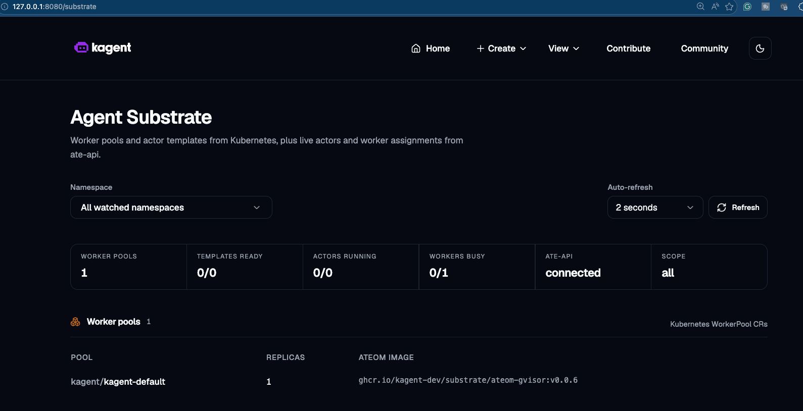
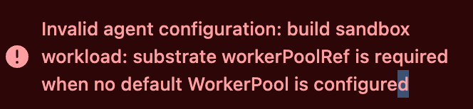

# kagent Integration: Install + `AgentHarness` Walkthrough

End-to-end lab for the kagent integration with Substrate. Installs kagent OSS configured to use Substrate as a runtime, creates a default `WorkerPool`, then walks through a substrate-backed `AgentHarness` from apply to first request through the harness gateway.



## What kagent Provides

When `controller.substrate.enabled=true`, kagent supports `runtime: substrate` on `kagent.dev/v1alpha2` `AgentHarness` resources. For each substrate harness, kagent:

- Watches the `AgentHarness` resources with `spec.runtime: substrate`
- References an existing Substrate `WorkerPool` (configurable per harness or via a default)
- **Generates one `ActorTemplate` per substrate `AgentHarness`**
- Uses `ate-api` to create, resume, and delete actors
- Exposes a browser/API gateway path through the kagent controller

kagent **does not** install Substrate and **does not** own `WorkerPool` capacity - those are platform/substrate-admin concerns.

## Lab Objectives

**Part 1 - Install kagent with Substrate enabled:**

- Install kagent CRDs + kagent itself (chart `0.9.7`) with `controller.substrate.*` flags pointing at `ate-system`
- Create a `kagent-default` `WorkerPool` via the same Helm release
- Verify the `/substrate` UI page shows your workers

**Part 2 - Use a substrate-backed `AgentHarness`:**

- Confirm the `AgentHarness` CRD has `substrate` in its `runtime` enum
- Create a gateway-token Secret
- Apply an `AgentHarness` (`openclaw-substrate-demo`) with `runtime: substrate`
- Watch condition progression `Accepted` → `ActorTemplateReady` → `ActorReady` → `Ready`
- Inspect the generated `ActorTemplate` and call the harness gateway

## Prerequisites

- Baseline setup complete: [001](001-baseline-setup.md) → [002](002-gcp-iam-and-bucket.md) → [003](003-install-substrate.md)
- An **LLM provider API key**. Anthropic is the workshop default; kagent also accepts OpenAI, Gemini, Ollama:

 ```bash
 export ANTHROPIC_API_KEY=<your-anthropic-api-key>
 ```

- `envsubst` (for the parameterized AgentHarness manifest)

## Ordering Matters

If you set `controller.substrate.enabled: true` on a cluster where `ate-api.ate-system.svc:443` isn't reachable, the kagent controller pod will **hard-exit on startup** (Substrate dial failure → `os.Exit(1)`) and crash-loop indefinitely. Creating an Agent that needs Substrate fails with:



So: confirm [003](003-install-substrate.md) is healthy (`kubectl get pods -n ate-system` all Ready) before running Part 1 below. If you ever upgrade kagent without checking Substrate is healthy, the controller pod can get stuck looping for the same reason - set `controller.substrate.enabled: false` temporarily to recover.

---

# Part 1 - Install kagent with Substrate enabled

## 1. Install kagent CRDs

```bash
helm upgrade kagent-crds \
 oci://ghcr.io/kagent-dev/kagent/helm/kagent-crds \
 --version 0.9.7 \
 -n kagent --create-namespace
```

## 2. Install kagent with the Substrate Flags

The flag list is long. Each `controller.substrate.*` flag is what wires kagent into Substrate; `substrateWorkerPool.*` creates the default `WorkerPool` for `AgentHarness` resources to consume.

```bash
helm upgrade --install kagent \
 oci://ghcr.io/kagent-dev/kagent/helm/kagent \
 --version 0.9.7 \
 -n kagent \
 --set providers.default=anthropic \
 --set providers.anthropic.apiKey="$ANTHROPIC_API_KEY" \
 --set controller.agentImage.tag="" \
 --set controller.skillsInitImage.tag="" \
 --set controller.image.registry="" \
 --set controller.image.repository=kagent-dev/kagent/controller \
 --set controller.image.tag="" \
 --set controller.image.pullPolicy="" \
 --set ui.image.registry="" \
 --set ui.image.repository=kagent-dev/kagent/ui \
 --set ui.image.tag="" \
 --set ui.image.pullPolicy="" \
 --set controller.substrate.enabled=true \
 --set controller.substrate.defaultWorkerPool.namespace=kagent \
 --set controller.substrate.defaultWorkerPool.name=kagent-default \
 --set substrateWorkerPool.create=true \
 --set substrateWorkerPool.name=kagent-default \
 --set substrateWorkerPool.replicas=1 \
 --set controller.substrate.ateApiEndpoint="dns:///api.ate-system.svc:443" \
 --set controller.substrate.ateApiInsecure=true \
 --set controller.substrate.atenetRouterURL="http://atenet-router.ate-system.svc:80" \
 --set controller.substrate.ateApiTokenFile="/var/run/secrets/tokens/ate-api/token" \
 --set substrateWorkerPool.ateomImage=ghcr.io/kagent-dev/substrate/ateom-gvisor:v0.0.6
```

What the key flags do:

| Flag | Purpose |
|---|---|
| `providers.default=anthropic` + `providers.anthropic.apiKey` | LLM provider for kagent's own model calls. Swap to `openAI` / `gemini` / `ollama` if needed. |
| `controller.image.tag=""` etc. | Lets the chart use its built-in default image refs (avoids the `<registry>/<repo>:<tag>` triplet getting hard-coded to anything stale). |
| `controller.substrate.enabled=true` | Turns on the substrate integration in the controller. |
| `controller.substrate.defaultWorkerPool.{namespace,name}` | If an `AgentHarness` omits `spec.substrate.workerPoolRef`, this is the default. |
| `substrateWorkerPool.create=true` + `replicas=1` | Creates the `WorkerPool` resource in the same release. Without a `WorkerPool` you can't create any substrate-backed `AgentHarness`. |
| `controller.substrate.ateApiEndpoint="dns:///api.ate-system.svc:443"` | gRPC URL of the Substrate control plane. Note `dns:///` - this is gRPC name-resolver syntax, not a typo. |
| `controller.substrate.ateApiInsecure=true` | TLS off for the gRPC dial. Fine inside the cluster; flip to `false` and provide a cert for prod. |
| `controller.substrate.atenetRouterURL=http://atenet-router.ate-system.svc:80` | Where the harness gateway forwards traffic to the actor. |
| `controller.substrate.ateApiTokenFile=/var/run/secrets/tokens/ate-api/token` | Projected token volume the controller uses to identify itself to `ate-api`. |
| `substrateWorkerPool.ateomImage=ghcr.io/kagent-dev/substrate/ateom-gvisor:v0.0.6` | The "interior gVisor" image that runs inside each worker pod. **Pin this** - floating tags break across Substrate releases. |

## 3. Wait for kagent

```bash
kubectl get pods -n kagent -w
```

You should see:

| Pod prefix | Replicas |
|---|---|
| `kagent-controller` | 1 |
| `kagent-ui` | 1 |
| `kagent-postgresql` | 1 |
| Pre-built agents (`k8s-agent`, `istio-agent`, etc.) | several |

Smoke-test the kagent ↔ Substrate handshake:

```bash
kubectl run substrate-status-check -n kagent --rm -i --restart=Never \
 --image=curlimages/curl:8.10.1 -- \
 http://kagent-controller:8083/api/substrate/status
```

You're looking for `"enabled": true` in the response.

## 4. Open the `/substrate` UI

```bash
kubectl -n kagent port-forward service/kagent-ui 8080:8080
```

Browse to <http://localhost:8080/substrate>. You should see the `kagent-default` `WorkerPool` and its 1 warm worker listed - matching the screenshot at the top of this lab.

## Troubleshooting

- **Controller in `CrashLoopBackOff` immediately after install.** Substrate isn't healthy. `kubectl get pods -n ate-system` - if anything's not `Ready`, fix it before re-rolling kagent. As a last resort, temporarily disable the integration: `helm upgrade kagent ... --set controller.substrate.enabled=false` to get the controller back, debug Substrate, then re-enable.
- **`/substrate` page shows the suberror screenshot above.** Either Substrate isn't installed, the `ate-api` endpoint is wrong, or the `kagent-default` `WorkerPool` wasn't created (`substrateWorkerPool.create=true` skipped or failed).
- **`substrate-status-check` returns `enabled: false`.** The controller saw `controller.substrate.enabled=true` but failed to validate against `ate-api`. Inspect `kubectl logs -n kagent deploy/kagent-controller | grep -i substrate`.
- **`/api/substrate/status` returns a 404.** Wrong port - the controller API is on `8083`, not `8080`.

## Non-GKE Cluster Note

The Substrate Helm chart's JWT issuer defaults are GKE-flavored. If you're not on GKE (or kind), you also need to override the issuer + audience when installing Substrate so the kagent UI's `/substrate` page can validate tokens. See [040 step 2 - "If You're Not on GKE or Kind"](003-install-substrate.md#if-youre-not-on-gke-or-kind).

---

# Part 2 - Substrate-Backed `AgentHarness` Walkthrough

## Demo Values You'll Need

You will replace these with your own values. The source documentation hardcoded a `felevan` bucket; this workshop parameterizes everything.

| Setting | Value to use |
|---|---|
| kagent namespace | `kagent` |
| Substrate namespace | `ate-system` |
| `ate-api` service | `api.ate-system.svc:443` |
| `atenet-router` URL | `http://atenet-router.ate-system.svc:80` |
| Default WorkerPool (created by [060](020-kagent-integration.md)) | `kagent/kagent-default` |
| Snapshot bucket (yours) | `gs://<YOUR_SNAPSHOT_BUCKET>/kagent/<HARNESS_NAME>/` |

Export the per-harness values once:

```bash
export HARNESS_NAME=openclaw-substrate-demo
export WORKER_POOL_NAME=kagent-default
export SNAPSHOT_BUCKET="gs://<YOUR_SNAPSHOT_BUCKET>/kagent/${HARNESS_NAME}/"
export SUBSTRATE_GATEWAY_TOKEN=$(openssl rand -hex 32)
```

> **Use a real random gateway token.** The `openssl rand -hex 32` above generates 256 bits of entropy. **Do not commit the token.** If you do, rotate it immediately.

## 9. Verify kagent Has the Substrate Schema

```bash
kubectl get crd agentharnesses.kagent.dev \
 -o jsonpath='{.spec.versions[?(@.name=="v1alpha2")].schema.openAPIV3Schema.properties.spec.properties.runtime.enum}'
```

Expected:

```text
["openshell","substrate"]
```

If you don't see `substrate` in the list, kagent is too old / the wrong chart - confirm you installed `0.9.7` per [060](020-kagent-integration.md).

## 10. Find a WorkerPool

```bash
kubectl get workerpools.ate.dev -A
```

If [060](020-kagent-integration.md) created the default for you, you'll see `kagent/kagent-default`. Pin it explicitly in `spec.substrate.workerPoolRef.name`, or omit `workerPoolRef` and let kagent's `controller.substrate.defaultWorkerPool.name` setting fill it in.

## 11. Open the `/substrate` UI

```bash
kubectl -n kagent port-forward service/kagent-ui 8080:8080
```

Open <http://localhost:8080/substrate> - you should see the `kagent-default` pool. The page updates live as you apply harnesses in the next steps.

## 12. Create the Gateway Token Secret

The OpenClaw / NemoClaw gateway authenticates inbound requests with a bearer token. Use a real random token; store it in a Kubernetes Secret. The manifest at [`assets/agentharness/gateway-token.yaml`](assets/agentharness/gateway-token.yaml) takes `${SUBSTRATE_GATEWAY_TOKEN}` from the env:

```bash
envsubst < assets/agentharness/gateway-token.yaml | kubectl apply -f -
```

Confirm:

```bash
kubectl get secret my-substrate-gateway-token -n kagent
```

## 9. Create a Substrate AgentHarness

The parameterized manifest is at [`assets/agentharness/openclaw-substrate-demo.yaml`](assets/agentharness/openclaw-substrate-demo.yaml). It uses `${HARNESS_NAME}`, `${WORKER_POOL_NAME}`, and `${SNAPSHOT_BUCKET}` - all three exported above.

```yaml
apiVersion: kagent.dev/v1alpha2
kind: AgentHarness
metadata:
 name: ${HARNESS_NAME}
 namespace: kagent
spec:
 backend: openclaw # openclaw or nemoclaw
 runtime: substrate
 description: OpenClaw harness running on Agent Substrate
 modelConfigRef: default-model-config
 substrate:
 workerPoolRef:
 name: ${WORKER_POOL_NAME}
 gatewayTokenSecretRef:
 name: my-substrate-gateway-token
 snapshotsConfig:
 location: ${SNAPSHOT_BUCKET}
```

Apply:

```bash
envsubst < assets/agentharness/openclaw-substrate-demo.yaml | kubectl apply -f -
```

> If the kagent controller has `controller.substrate.defaultWorkerPool.name=kagent-default` configured (it does, after [060](020-kagent-integration.md)), the `workerPoolRef:` block is **optional** - you can drop it and let the default take over. Pinning it explicitly is more discoverable; both work.

## 10. Watch Readiness

```bash
kubectl get agentharness "$HARNESS_NAME" -n kagent -w
```

Full status:

```bash
kubectl get agentharness "$HARNESS_NAME" -n kagent -o yaml
```

Expected condition progression:

```text
Accepted → manifest passes admission
ActorTemplateReady → kagent created the ActorTemplate, Substrate built the golden snapshot
ActorReady → ate-api created/resumed the actor
Ready → end-to-end ready; the gateway path will serve traffic
```

If any condition stays `False`, look at the `message` field on that condition - it usually points at the actual issue (`workerPoolRef is required`, golden-snapshot timeout, gateway-token Secret missing).

## 11. Inspect Generated Substrate Resources

```bash
kubectl get workerpools.ate.dev -A
kubectl get actortemplates.ate.dev -A
kubectl get agentharnesses.kagent.dev -n kagent
```

You should see a new `ActorTemplate` in the `kagent` namespace owned by the `AgentHarness` (check via `kubectl get actortemplate <name> -n kagent -o yaml` and look at `metadata.ownerReferences`). The `WorkerPool` is **externally owned** - it predates the harness and outlives it.

kagent's ownership model:

| Resource | Owner | Lifecycle |
|---|---|---|
| `AgentHarness` | You | You apply and delete it |
| `ActorTemplate` (generated) | The `AgentHarness` (owner reference) | Garbage-collected by Kubernetes when the harness is deleted |
| `WorkerPool` | Platform / substrate admin | Long-lived; outlives any individual harness |
| `Actor` (in Valkey) | kagent controller | Created on harness `Ready`; **deleted** by kagent when the harness is deleted (not GC'd) |

## 12. Use the Harness Gateway

Once `Ready=True`, kagent exposes a gateway path through the controller:

```
/api/agentharnesses/kagent/${HARNESS_NAME}/gateway/
```

Port-forward the controller (in a separate terminal if the `kagent-ui` port-forward is already running):

```bash
kubectl -n kagent port-forward service/kagent-controller 8083:8083
```

Open <http://localhost:8083/api/agentharnesses/kagent/openclaw-substrate-demo/gateway/>.

The gateway path will exercise the substrate-backed actor - first request triggers an on-demand `ResumeActor` if the actor is suspended (visible in `kubectl ate get actor` flipping to `RUNNING`), then proxies through.

## Troubleshooting

| Symptom | Likely cause |
|---|---|
| `Missing actortemplates.ate.dev or workerpools.ate.dev` | Substrate isn't installed - [040](003-install-substrate.md). |
| `spec.substrate.workerPoolRef is required` | The default WorkerPool isn't configured on the controller. Either set `spec.substrate.workerPoolRef.name` on the harness or rerun [060](020-kagent-integration.md) with `controller.substrate.defaultWorkerPool.name=kagent-default`. |
| `ActorTemplateReady=False` | Substrate hasn't finished building the golden snapshot. `kubectl describe actortemplate <name> -n kagent` and `kubectl get pods -n kagent` to find the Golden Pod and look at its logs. |
| `ActorReady=False` | kagent created the template, but `ate-api` hasn't created or resumed the actor yet. `kubectl logs -n kagent deploy/kagent-controller \| grep -i substrate`. |
| Gateway returns `503 Service Unavailable` | Check `controller.substrate.atenetRouterURL` resolves, actor is `RUNNING` (`kubectl ate get actor`), and the gateway-token Secret exists. |
| Gateway returns `401 Unauthorized` | Wrong / missing gateway token. The Secret `my-substrate-gateway-token` must have key `token` - `kubectl get secret my-substrate-gateway-token -n kagent -o yaml`. |

## Notes

- Substrate support is for `AgentHarness`, **not** the regular `Agent` CRD.
- Supported substrate harness backends today: `openclaw` and `nemoclaw`.
- `gatewayTokenSecretRef` is preferred over the inline `gatewayToken` field.
- `snapshotsConfig.location` must be a `gs://` URI - Substrate's GCS path. Pick a per-harness subfolder so you can correlate snapshots to harnesses cleanly.
- Deleting the `AgentHarness` deletes the actor (kagent calls `DeleteActor`) and Kubernetes GC removes the generated `ActorTemplate`. The `WorkerPool` is untouched.

## Cleanup

```bash
kubectl delete agentharness "$HARNESS_NAME" -n kagent
kubectl delete secret my-substrate-gateway-token -n kagent

# (Optional) confirm the generated ActorTemplate was GC'd
kubectl get actortemplates.ate.dev -A
```

## Cleanup

```bash
# Part 2 resources
kubectl delete agentharness "${HARNESS_NAME:-openclaw-substrate-demo}" -n kagent --ignore-not-found
kubectl delete secret my-substrate-gateway-token -n kagent --ignore-not-found

# Part 1: uninstall kagent
helm uninstall kagent -n kagent 2>/dev/null || true
helm uninstall kagent-crds -n kagent 2>/dev/null || true
kubectl delete namespace kagent --ignore-not-found

unset HARNESS_NAME WORKER_POOL_NAME SNAPSHOT_BUCKET SUBSTRATE_GATEWAY_TOKEN ANTHROPIC_API_KEY
```

This leaves Substrate itself (the baseline from [003](003-install-substrate.md)) running. Other workshops or labs that depend on Substrate-the-product (not Substrate + kagent) keep working.

## Next

- [030 - Suspend / Resume Operations](030-operations.md)
- [040 - Observability](040-observability.md)
