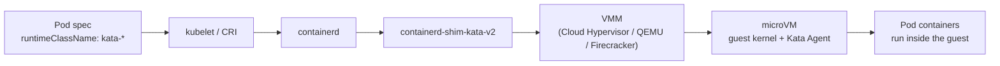

# Appendix - MicroVM Pod Isolation (Kata Containers on AKS + EKS)

The labs in this workshop sandbox actors with **gVisor** (`runsc`) - a syscall-interception sandbox where actors run under a userspace kernel while still sharing the host kernel. This appendix covers the adjacent **microVM** isolation model, where the pod runs inside a hardware-virtualized guest kernel via Kata Containers - useful context when discussing isolation trade-offs for agentic workloads. Note that Substrate does **not** use Kata; this is further reading on an alternative isolation boundary, with hands-on AKS and EKS walkthroughs.

A microVM is not isolation *within* a Pod. Instead, the Pod runs *inside* the microVM. The sandbox boundary sits at the pod level. All containers of one pod share one guest kernel, and that guest kernel is separate from the host's.

Standard Kubernetes pods share the node's Linux kernel and rely on
software-based boundaries: namespaces and cgroups. A kernel exploit in one pod
is a kernel exploit against every pod on that node. MicroVMs close that gap:
the pod runs inside a lightweight virtual machine with **its own guest
kernel**, and the boundary is enforced by the CPU's hardware virtualization
extensions (Intel VT-x / AMD-V via KVM, or Hyper-V on Azure).

This matters for agentic workloads specifically: if you're running untrusted
or LLM-generated code (agent tool execution, code interpreters, multi-tenant
agent platforms), namespaces-and-cgroups is not a security boundary you want
to bet on. A microVM gives each pod a VM-grade blast radius at near-container
speed (~150–300 ms boot overhead).

---

## How It Works

The glue between Kubernetes and the microVM is almost always
[Kata Containers](https://katacontainers.io/). Kubernetes never talks to a
hypervisor directly; it goes through the standard container runtime path:



1. **RuntimeClass**: the pod spec sets `runtimeClassName` to a Kata runtime
   class. Pods without it keep using `runc` (standard containers). Both types
   coexist on the same node.
2. **CRI delegation**: the kubelet passes the pod to containerd, which maps
   the runtime class to the Kata shim (`containerd-shim-kata-v2`) instead of
   the default `runc` shim.
3. **VMM boots a microVM**: the shim launches a Virtual Machine Monitor,
   which boots a minimal guest kernel in a lightweight VM.
4. **Kata Agent creates the containers**: an agent inside the guest receives
   the OCI container specs from the shim and runs the pod's containers inside
   the guest kernel.

Kubernetes schedules, scales, and deletes the pod like any other; the
microVM is invisible to the control plane.

### The VMM landscape (where Firecracker actually fits)

Firecracker is *one* VMM option, not the mechanism itself:

| VMM | Origin | Sweet spot | Notes |
|---|---|---|---|
| **Cloud Hypervisor** | Linux Foundation (Rust) | Kubernetes pod sandboxing | Default for AKS Pod Sandboxing; supports device passthrough |
| **QEMU** | Long-standing OSS | Broadest hardware/arch support | Kata's default shim (`kata-qemu`) |
| **Firecracker** | AWS (Rust) | Serverless density (Lambda, Fargate) | ~125 ms boots; **no device/GPU passthrough**; in Kata requires the devmapper snapshotter |

On its own, Firecracker has no Kubernetes integration. AWS runs it *under*
Lambda and Fargate, not for your EKS pods. To use it in Kubernetes you go
through Kata with the Firecracker backend (`kata-fc`).

### What you get

- **Host protection**: a container escape lands in a throwaway guest kernel,
  not the node's kernel.
- **Noisy-neighbor mitigation**: CPU/memory are hardware-virtualized per pod.
- **Multi-tenant security**: untrusted tenants or AI agents share a cluster
  without sharing a kernel.

### What it costs

- Extra memory per pod (guest kernel + VMM ≈ 130–160 Mi overhead; the
  RuntimeClass declares this as `overhead.podFixed` so the scheduler accounts
  for it).
- ~150–300 ms added pod start latency.
- Some features don't work: `hostNetwork`, and (depending on VMM) device
  passthrough. Check the
  [Kata limitations doc](https://github.com/kata-containers/kata-containers/blob/main/docs/Limitations.md).

---

## Prerequisites

| Tool | Version | Notes |
|---|---|---|
| `kubectl` | ≥ 1.30 | Both demos |
| Azure CLI (`az`) | ≥ 2.80.0 | AKS demo (required minimum per Microsoft docs) |
| `eksctl` | ≥ 0.200.0 | EKS demo |
| AWS CLI (`aws`) | ≥ 2.15 | EKS demo, authenticated (`aws sts get-caller-identity`) |
| `helm` | ≥ 3.15 | EKS demo (kata-deploy is an OCI Helm chart) |
| `jq` | ≥ 1.7 | EKS demo (release-version lookup) |

Cluster requirements:

- **AKS**: Kubernetes ≥ 1.27, Azure Linux node OS, a generation-2 VM size
  with nested virtualization (e.g., `Standard_D4s_v3`).
- **EKS**: **bare-metal** instances (e.g., `i3.metal`, `m5.metal`). Standard
  EC2 VMs don't allow nested virtualization, so `/dev/kvm` is unavailable.

> **💸 Cost warning (EKS):** metal instances run roughly **$4–5/hour**
> depending on type and region. Do this demo in one sitting and tear it down.
> The AKS path is far cheaper (`Standard_D4s_v3` ≈ $0.20/hour).

---

## Part 1: AKS Pod Sandboxing

Azure ships this as a first-class feature: Kata Containers on the Azure Linux
container host, with **Cloud Hypervisor** as the VMM under the Microsoft
Hyper-V hypervisor. Note again: Azure's managed offering does **not** use
Firecracker.

### 1.1 Create the cluster

```bash
export RG=microvm-demo-rg
export CLUSTER=microvm-aks
export LOCATION=eastus

az group create --name $RG --location $LOCATION

az aks create \
    --name $CLUSTER \
    --resource-group $RG \
    --os-sku AzureLinux \
    --workload-runtime KataVmIsolation \
    --node-vm-size Standard_D4s_v3 \
    --node-count 2 \
    --generate-ssh-keys
```

The three flags that matter:

- `--workload-runtime KataVmIsolation`: enables Pod Sandboxing on the node pool.
- `--os-sku AzureLinux`: the only node OS that supports it.
- `--node-vm-size`: must be a generation-2 size with nested virtualization
  (Dsv3 family works).

> **Existing cluster?** Add a sandboxing node pool instead:
>
> ```bash
> az aks nodepool add \
>     --cluster-name $CLUSTER \
>     --resource-group $RG \
>     --name katapool \
>     --os-sku AzureLinux \
>     --workload-runtime KataVmIsolation \
>     --node-vm-size Standard_D4s_v3
> ```

Get credentials:

```bash
az aks get-credentials --resource-group $RG --name $CLUSTER
kubectl get nodes -o wide
```

### 1.2 Verify the RuntimeClass exists

AKS pre-creates the runtime class; you don't install anything:

```bash
kubectl get runtimeclass
```

You should see `kata-vm-isolation` in the list.

### 1.3 Deploy a sandboxed pod and a normal pod

Below, you'll see `runtimeClassName: kata-vm-isolation`. The Kata shim launches the VMM as a plain Linux process on the k8s Worker Node that the Pod gets scheduled on. On AKS that's a cloud-hypervisor process. That process is the microVM; it boots a minimal guest kernel in a few hundred milliseconds. The Kata Agent inside the guest starts your containers in the guest kernel. Because the VMM process (the microVM) is running on the Worker Node, the hardware isolation can be managed for Pods running sandboxed Agents.

The enforcement of the hardware isolation comes from:
1. The CPU's virtualization extensions (Intel VT-x / AMD-V)
2. The Hypervisor itself (e.g - Hyper-V on AKS or KVM on general Linux nodes)

`aks-kata-pod.yaml`: the **only** difference from a normal pod is one line:

```yaml
kind: Pod
apiVersion: v1
metadata:
  name: isolated-pod
spec:
  runtimeClassName: kata-vm-isolation
  containers:
  - name: kata
    image: mcr.microsoft.com/aks/fundamental/base-ubuntu:v0.0.11
    command: ["/bin/sh", "-ec", "while :; do echo '.'; sleep 5 ; done"]
    resources:
      requests:
        cpu: 100m
        memory: 128Mi
      limits:
        cpu: 250m
        memory: 256Mi
```

`aks-normal-pod.yaml`: same workload, no runtime class:

```yaml
kind: Pod
apiVersion: v1
metadata:
  name: normal-pod
spec:
  containers:
  - name: non-kata
    image: mcr.microsoft.com/aks/fundamental/base-ubuntu:v0.0.11
    command: ["/bin/sh", "-ec", "while :; do echo '.'; sleep 5 ; done"]
    resources:
      requests:
        cpu: 100m
        memory: 128Mi
      limits:
        cpu: 250m
        memory: 256Mi
```

```bash
kubectl apply -f aks-kata-pod.yaml -f aks-normal-pod.yaml
kubectl wait --for=condition=Ready pod/isolated-pod pod/normal-pod --timeout=120s
```

### 1.4 Prove the isolation: two pods, two kernels

This is the money shot of the demo. Compare kernels:

```bash
kubectl exec isolated-pod -- uname -r
kubectl exec normal-pod   -- uname -r
```

Example output: the sandboxed pod runs a **different, dedicated guest
kernel** while the normal pod reports the node's kernel:

```text
# isolated-pod (inside the microVM)
6.6.96.mshv1

# normal-pod (node's shared kernel)
6.6.100.mshv1-1.azl3
```

Same node, same cluster, but the Kata pod cannot see or touch the kernel the
rest of the node runs on.

### 1.5 AKS limitations to know

- `hostNetwork` is not supported in Kata pods.
- Microsoft Defender for Containers can't assess Kata runtime pods.
- IOPS on Azure Files / local SSD may trail `runc` pods.
- Memory sizing works differently: the VM carves out resources per pod. See
  [Considerations for Pod Sandboxing](https://learn.microsoft.com/en-us/azure/aks/considerations-pod-sandboxing).

### 1.6 Cleanup

```bash
kubectl delete pod isolated-pod normal-pod
az aks delete --resource-group $RG --name $CLUSTER --yes --no-wait
az group delete --name $RG --yes --no-wait
```

---

## Part 2: EKS + Kata Containers

EKS has no managed pod-sandboxing feature; you install Kata yourself with
the **kata-deploy** Helm chart on **bare-metal nodes**. In exchange you get to
pick the VMM, including Firecracker.

### 2.1 Create the cluster

```bash
export CLUSTER=microvm-eks
export REGION=us-east-1

eksctl create cluster \
  --name $CLUSTER \
  --region $REGION \
  --version 1.32 \
  --without-nodegroup
```

### 2.2 Add a bare-metal node group

`metal-node-group.yaml`:

```yaml
apiVersion: eksctl.io/v1alpha5
kind: ClusterConfig
metadata:
  name: microvm-eks
  region: us-east-1
managedNodeGroups:
  - name: metal-nodes
    instanceType: i3.metal
    amiFamily: Ubuntu2204
    desiredCapacity: 1
    volumeSize: 150
    volumeType: gp3
```

```bash
eksctl create nodegroup -f metal-node-group.yaml
kubectl get nodes -o wide
```

Why metal: Kata's VMMs need KVM (`/dev/kvm`), and standard EC2 instances are
themselves VMs without nested virtualization. `i3.metal` and `m5.metal` both
work. Expect the node group to take 15–20 minutes; metal boxes are slow to
provision.

> AWS's own walkthrough used EKS 1.29 with `Ubuntu2004`; this doc bumps both.
> Any currently supported EKS version works; the constraint is the metal
> instance, not the K8s version.

### 2.3 Install Kata with the kata-deploy Helm chart

> The old raw-manifest install
> (`kata-deploy.yaml` / `kata-rbac.yaml` under `tools/packaging/kata-deploy/`)
> referenced by most blog posts **no longer exists** upstream; those URLs
> 404. Helm is the supported install path as of Kata v3.12+.

```bash
export KATA_VERSION=3.32.0   # latest release at time of writing (2026-06)

helm install kata-deploy \
  oci://ghcr.io/kata-containers/kata-deploy-charts/kata-deploy \
  --version "$KATA_VERSION" \
  --namespace kube-system

kubectl -n kube-system wait --timeout=10m --for=condition=Ready -l name=kata-deploy pod
```

kata-deploy runs a DaemonSet that drops the Kata runtime binaries onto every
node, patches the containerd config, and creates one RuntimeClass per
hypervisor "shim":

```bash
kubectl get runtimeclass
```

Expected (subset; kata-deploy creates classes for every enabled shim):

```text
NAME              HANDLER           AGE
kata-clh          kata-clh          1m    # Cloud Hypervisor
kata-fc           kata-fc           1m    # Firecracker
kata-qemu         kata-qemu         1m    # QEMU (Kata's default)
...
```

### 2.4 Deploy a sandboxed pod

`eks-kata-pod.yaml`, using `kata-qemu` (the default shim; works with
containerd's default snapshotter, no extra node prep):

```yaml
apiVersion: v1
kind: Pod
metadata:
  name: kata-redis
spec:
  runtimeClassName: kata-qemu
  containers:
  - name: redis
    image: public.ecr.aws/docker/library/redis:7.2
    ports:
    - containerPort: 6379
    resources:
      requests:
        cpu: 250m
        memory: 256Mi
      limits:
        cpu: 500m
        memory: 512Mi
```

And the control pod, `eks-normal-pod.yaml`:

```yaml
apiVersion: v1
kind: Pod
metadata:
  name: normal-redis
spec:
  containers:
  - name: redis
    image: public.ecr.aws/docker/library/redis:7.2
    ports:
    - containerPort: 6379
    resources:
      requests:
        cpu: 250m
        memory: 256Mi
      limits:
        cpu: 500m
        memory: 512Mi
```

```bash
kubectl apply -f eks-kata-pod.yaml -f eks-normal-pod.yaml
kubectl wait --for=condition=Ready pod/kata-redis pod/normal-redis --timeout=180s
```

### 2.5 Prove the isolation

Same kernel-comparison test as AKS:

```bash
kubectl exec kata-redis    -- uname -r
kubectl exec normal-redis  -- uname -r
```

The Kata pod reports the **guest** kernel Kata ships (e.g., `6.x` built by the
Kata project); the normal pod reports the Ubuntu node kernel. Different
kernels on the same node = hardware-virtualized boundary.

Bonus verification: see the actual VMM process on the node (via a debug
shell on the node):

```bash
NODE=$(kubectl get pod kata-redis -o jsonpath='{.spec.nodeName}')
kubectl debug node/$NODE -it --image=ubuntu:22.04 -- \
  chroot /host sh -c "ps aux | grep -E 'qemu|cloud-hypervisor|firecracker' | grep -v grep"
```

You'll see one hypervisor process per running Kata pod; that process *is*
your pod's microVM.

### 2.6 Optional: switch to Cloud Hypervisor or Firecracker

**Cloud Hypervisor** is a drop-in swap; change one line:

```yaml
  runtimeClassName: kata-clh
```

**Firecracker** (`kata-fc`) is *not* drop-in: it can't use containerd's
default overlayfs snapshotter and requires the **devmapper snapshotter**
pre-configured on the node (a dedicated thin-pool block device) before the
runtime class will work. That's real node-image surgery, out of scope for
this demo; see the
[Kata devmapper how-to](https://github.com/kata-containers/kata-containers/blob/main/docs/how-to/how-to-use-kata-containers-with-firecracker.md)
if you want to go there. For pods on Kubernetes, `kata-clh` gets you the same
Rust-VMM, hardware-isolated properties with none of the snapshotter friction,
which is exactly why AKS chose Cloud Hypervisor.

### 2.7 Cleanup

Metal instances bill by the hour; don't skip this.

```bash
kubectl delete pod kata-redis normal-redis
helm uninstall kata-deploy -n kube-system

eksctl delete cluster \
  --name $CLUSTER \
  --region $REGION \
  --disable-nodegroup-eviction \
  --wait
```

---

## Cleanup

Both demo paths carry their own teardown steps - run whichever applies:

- **AKS**: [1.6 Cleanup](#16-cleanup) - deletes the demo pods, the cluster, and the resource group.
- **EKS**: [2.7 Cleanup](#27-cleanup) - deletes the demo pods, uninstalls kata-deploy, and deletes the cluster. Metal instances bill by the hour; don't skip this.

---

## How Substrate Uses MicroVM

[Agent Substrate](https://github.com/agent-substrate/substrate), the actor
runtime covered in [this workshop](README.md), added a microVM sandbox
class in June 2026 ([issue #123](https://github.com/agent-substrate/substrate/issues/123),
[PR #287](https://github.com/agent-substrate/substrate/pull/287)) and it's a
useful counter-example to everything above: same microVM building blocks,
wired up a completely different way.

Substrate offers two sandbox classes for actors:

- **gVisor**: `runsc` nested inside the worker pod. Full checkpoint/restore,
  including disk. Software isolation (userspace kernel, shared host kernel).
- **microVM**: Cloud Hypervisor nested inside the worker pod. Hardware-enforced
  isolation with memory-only snapshots; RAM state survives suspend/resume while
  the rootfs resets to a golden image.

Both follow the same architectural signature: the sandbox runs *inside* an
ordinary worker pod under Substrate's own control, rather than underneath the
pod via `runtimeClassName`.

Why skip the RuntimeClass + Kata shim path this doc just demoed? Because for
agent workloads, Substrate gets you strictly more. A plain Kata pod gives you
hardware isolation, but that's all it gives you: every idle agent still holds
a full microVM (and its memory overhead) on a node, and the only lifecycle
operations you have are create and delete. Kill the pod and the agent's
in-memory state is gone. Substrate combines the same hardware isolation with
the ability to suspend an agent, snapshot its full RAM state to object
storage, release the worker entirely, and resume it later (even on a
different node) in about 75 ms via userfaultfd on-demand restore, versus
~1.8 s for an eager restore. Idle agents cost nothing but storage. The Kata
shim has no snapshot API, so Substrate kept Kata's guest components (the
guest kernel and Kata Agent), dropped the shim, and drives Cloud Hypervisor
directly through its own runtime (`ateom-microvm`). The result: microVM-grade
isolation per agent, with the density and suspend/resume economics that
stateless Kata pods can't match.

The takeaway: RuntimeClass is how *Kubernetes* selects a microVM runtime per
pod, but it's not the only way microVMs show up in a cluster. Platforms that
need lifecycle control the shim doesn't offer (snapshotting, live resume,
cross-node restore) can own the VMM process themselves; the hardware
enforcement (VT-x/AMD-V via KVM) is identical either way.

---

## References

- [Pod Sandboxing with AKS (Microsoft Learn)](https://learn.microsoft.com/en-us/azure/aks/use-pod-sandboxing)
- [Kata Containers on Amazon EKS (AWS Containers Blog)](https://aws.amazon.com/blogs/containers/enhancing-kubernetes-workload-isolation-and-security-using-kata-containers/) *(install URLs outdated; use the Helm chart above)*
- [Kata Containers installation docs (Helm chart)](https://kata-containers.github.io/kata-containers/installation/)
- [Kata Containers virtualization design](https://github.com/kata-containers/kata-containers/blob/main/docs/design/virtualization.md)
- [Kata Containers limitations](https://github.com/kata-containers/kata-containers/blob/main/docs/Limitations.md)
- [Firecracker](https://firecracker-microvm.github.io/) / [Cloud Hypervisor](https://www.cloudhypervisor.org/)

## Related

- [appendix-why-gke](appendix-why-gke.md) - the gVisor / Pod Certificate context for the workshop's main path
- [README](README.md) - workshop overview and lab index
