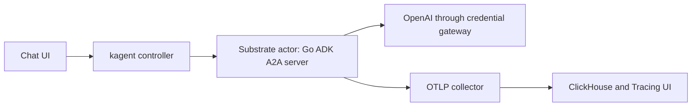

# Trace-enabled Go ADK agent

This demo builds a programmatic Go ADK agent and runs it through a `kagent: {}` Harness on Agent Substrate. A model call produces a GenAI span; asking it to add two integers also exercises a function tool. The A2A server uses kagent's executor to flush spans before Substrate suspends the actor. The model credential stays in the existing `default-model-config` Secret and is injected into outbound requests by the Substrate egress gateway, not baked into the image.

## Architecture



The Harness image serves A2A gRPC on port 80 and `GET /readyz` on port 8081. The `AgentTemplate` references `default-model-config`, which lets the controller authorize OpenAI egress and inject the referenced Secret as a destination-scoped header. The agent's model name in `MODEL_NAME` must match that ModelConfig. The `kagent` compiler also supplies OTLP configuration, the collector hostname in the actor's egress policy, and pre-response flushing. This custom image constructs the ADK agent itself rather than reading the compiled prompt from `KAGENT_CONFIG_JSON`.

## Prerequisites

- A Kubernetes cluster with `kagent-enterprise` `1.0.0-alpha3`, the pinned `v1.0.0-alpha2` kagent Go API, Substrate `0.2.0-beta5`, and a ready `kagent/kagent-default` WorkerPool.
- The kagent collector and traces pipeline enabled, with OTLP gRPC reachable at `solo-enterprise-telemetry-collector.kagent.svc.cluster.local:4317`.
- A working Substrate snapshot bucket. `agent.yaml` uses `gs://ate-snapshots/kagent/adk-trace-enabled/`, which resolves to the bundled RustFS/S3 backend on this demo cluster; the `gs://` URI alone does not switch Substrate to GCS.
- `kagent/default-model-config` using OpenAI `gpt-4.1-mini`, referencing a populated Secret. The Secret value is not passed in the Harness environment. The registry must be reachable by `atelet`, which pulls actor images rather than relying on pod `imagePullSecrets`.
- Go 1.27, Docker with buildx, `gcloud`, `envsubst`, and `kubectl`. Configure Docker's registry authentication before pushing.

## Quickstart

From this directory:

```sh
go mod tidy
make test
make build
make push
```

The default image repository is the demo registry in `field-engineering-us`; override `IMAGE_REPOSITORY` and `IMAGE_TAG` when using another registry. A copy of the image is already pushed under the digest in `agent.yaml`. To deploy it yourself:

```sh
kubectl apply --dry-run=server -f agent.yaml
kubectl apply -f agent.yaml
kubectl get agenttemplate adk-trace-enabled -n kagent -o yaml
```

If you build and push a different image, update the digest in `agent.yaml` before applying it. `agent.yaml.tmpl` and `make render` are optional tools for generating another manifest from `IMAGE`, `SNAPSHOT_LOCATION`, and `MODEL_NAME`.

The `Ready` condition must say `ActorTemplate golden snapshot is ready`. Open `adk-trace-enabled` in the UI and ask **"Add 17 and 25 using add_numbers."** The trace should contain the agent invocation, model calls and a tool execution. Check the stored span names if the UI does not show them:

```sh
kubectl exec -n kagent kagent-clickhouse-shard0-0 -- clickhouse-client --query \
  "SELECT SpanName, count() FROM kagent.otel_traces_json WHERE ServiceName = 'adk-trace-enabled-adk-trace-enabled' AND Timestamp > now() - INTERVAL 30 MINUTE GROUP BY SpanName ORDER BY SpanName"
```

A live turn on this cluster returned 42 and stored `invoke_agent`, `invocation`, two `generate_content` model spans and `execute_tool add_numbers`. The collector can only display spans the ADK runtime emits; the store query separates an exporter problem from a UI problem.

Sensitive-content capture is off by default. To opt into storing prompts and responses in telemetry, set `otel.captureSensitiveContent: true` on the kagent-enterprise chart after a privacy review, then run a new turn. The controller compiles that decision into this Harness; do not duplicate its `OTEL_*` settings in `Harness.spec.env`. The Go ADK emits its own GenAI spans, so the tracing page's turn-level Input/Output fields depend on the span data it actually records.

## Project Structure

- `main.go`: Go ADK model, tool, A2A server, tracing initialization and pre-response flush.
- `agent.yaml`: deployable, digest-pinned kagent Harness and AgentTemplate.
- `agent.yaml.tmpl`: optional source for rendering alternate image and bucket values.
- `Dockerfile`: static Linux image built with Go 1.27.
- `Makefile`: `setup`, `test`, `build`, `push`, `render`, `deploy`, and `clean` targets.

`make clean` removes this demo's Harness and AgentTemplate. It does not remove the image, shared ModelConfig, WorkerPool, or Substrate release. kagent can garbage-collect snapshots after the resources are removed; check for conversations that still use this runtime before cleaning up. The agent uses an in-memory ADK session service for this tracing demonstration; do not use it as a durable conversation store across actor replacement.
