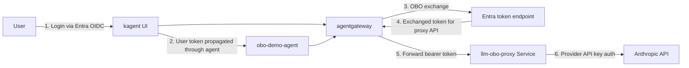

# Microsoft Entra ID OBO with Enterprise Agentgateway

End-to-end **On-Behalf-Of** token exchange with Microsoft Entra ID. The user logs into the kagent UI, the user's token is propagated through the agent (`KAGENT_PROPAGATE_TOKEN`), and when the agent calls the gateway-fronted LLM endpoint, **enterprise-agentgateway** exchanges that token for a new one scoped to the downstream backend (here, an in-cluster Python proxy) before forwarding. The proxy validates the exchanged Entra token, then calls Anthropic with a provider API key.

> **Heads-up — this lab uses a different install of kagent than [020](020-install-kagent-enterprise.md).** The OBO scenario was authored against the direct-Helm pattern (`kagent-mgmt` + `kagent-crds` + `kagent-enterprise` at chart `0.3.12`, `enterprise-agentgateway` at `v2.2.0`). Pick this lab **or** the Gloo Operator install — they install from different upstream chart streams and shouldn't be mixed on the same cluster.

## How Entra OBO Differs from RFC 8693

Microsoft Entra does **not** implement RFC 8693. It uses a proprietary OBO flow:

| Field | RFC 8693 (Keycloak, Okta) | Entra ID |
|---|---|---|
| `grant_type` | `urn:ietf:params:oauth:grant-type:token-exchange` | `urn:ietf:params:oauth:grant-type:jwt-bearer` |
| Subject token parameter | `subject_token` | `assertion` |
| Token use indicator | (n/a) | `requested_token_use=on_behalf_of` |
| Client auth | Basic Auth | Form-encoded `client_id` + `client_secret` |
| Response | Includes `issued_token_type` | Omits it, adds `ext_expires_in` |

The agentgateway-enterprise controller handles that difference natively via the `entra` block on `EnterpriseAgentgatewayPolicy`.

## Architecture



1. User logs in to the kagent UI via Entra OIDC.
2. The user's token is propagated through the agent (`KAGENT_PROPAGATE_TOKEN`).
3. The agent calls `/llm` on agentgateway; agentgateway performs OBO with Entra.
4. Agentgateway forwards the **exchanged** bearer token to the in-cluster `llm-obo-proxy`.
5. The proxy validates the exchanged Entra token's audience, then calls Anthropic with the provider API key.

## Prerequisites

- Kubernetes cluster ([001](001-provision-gke.md))
- Helm 3.x
- Enterprise license keys: `kagent-enterprise` and `enterprise-agentgateway`
- A Microsoft Entra ID tenant with admin access
- An Anthropic API key

## Step 1 — Register Entra App Registrations

You need a **backend** app registration (used by the kagent UI backend and the OBO confidential client) and a **frontend** SPA app registration (for browser login). For quick tests you can reuse the same registration for both, but only if it's configured for PKCE/SPA login.

### 1a. Backend (`kagent-backend`)

[Azure Portal — App registrations](https://portal.azure.com/#view/Microsoft_AAD_RegisteredApps/ApplicationsListBlade) → **New registration**:

- Name: `kagent-backend`
- Supported account types: Single tenant
- **Register**

Note the **Application (client) ID** → `KAGENT_BACKEND_CLIENT_ID`.

**Certificates & secrets** → **New client secret** → copy the **Value** → `KAGENT_BACKEND_CLIENT_SECRET`.

**Expose an API** → set the Application ID URI (e.g., `api://<KAGENT_BACKEND_CLIENT_ID>`) → add a delegated scope named `kagent-backend`.

### 1b. Frontend (`kagent-ui`)

**New registration**:

- Name: `kagent-ui`
- Supported account types: Single tenant
- Redirect URI: **Single-page application (SPA)** — leave blank for now; you'll add the HTTPS callback once you know the agentgateway external IP (Step 7a).
- **Register**

Note the **Application (client) ID** → `KAGENT_FRONTEND_CLIENT_ID`.

**API permissions** → **Add a permission** → **My APIs** → `kagent-backend` → add the `kagent-backend` delegated scope → **Grant admin consent**.

### 1c. Tenant ID

Note your **Directory (tenant) ID** → `TENANT_ID`.

## Step 2 — Collect Required Values

```bash
KAGENT_LICENSE_KEY=<enterprise kagent license key>
KAGENT_FRONTEND_CLIENT_ID=<browser SPA client>
AGW_LICENSE_KEY=<enterprise agw license key>
ANTHROPIC_API_KEY=<api key for the proxy → Anthropic call>
KAGENT_BACKEND_CLIENT_ID=<uuid of the backend Entra app>
KAGENT_BACKEND_CLIENT_SECRET=<client secret for the backend Entra app>
TENANT_ID=<Entra tenant id>
# Optional Entra group object ID → RBAC role mapping
K8S_TOKEN_PASSTHROUGH_GROUP_ID=<Entra group object ID for the UI login group>
KAGENT_ENT_VERSION=0.3.12
MGMT_CLUSTER=<your-cluster-name>
```

> `KAGENT_FRONTEND_CLIENT_ID` is the browser-facing client. For quick testing you can reuse `KAGENT_BACKEND_CLIENT_ID`, but only if that registration is configured for browser-based PKCE with the HTTPS callback you set in Step 7a.

## Step 3 — Create Kubernetes Secrets

```bash
kubectl create namespace kagent

# Shared Entra OIDC client secret for both the UI backend and the runtime controller
kubectl create secret generic kagent-enterprise-oidc-secret \
  -n kagent \
  --from-literal=clientSecret="${KAGENT_BACKEND_CLIENT_SECRET}"

# Anthropic API key for the proxy
kubectl create secret generic kagent-anthropic \
  -n kagent \
  --from-literal=ANTHROPIC_API_KEY="${ANTHROPIC_API_KEY}"
```

You also need the enterprise license Secret:

```bash
kubectl create secret generic enterprise-kagent-license \
  -n kagent \
  --from-literal=enterprise-kagent-license-key="${KAGENT_LICENSE_KEY}"
```

## Step 4 — Install Solo Enterprise for kagent (Direct Helm)

Create `management.yaml`:

```yaml
cluster: "${MGMT_CLUSTER}"

products:
  kagent:
    enabled: true
  agentgateway:
    enabled: true
    namespace: "agentgateway-system"

oidc:
  issuer: "https://login.microsoftonline.com/${TENANT_ID}/v2.0"
  additionalScopes:
    - "offline_access"
    - "api://${KAGENT_BACKEND_CLIENT_ID}/kagent-backend"

ui:
  backend:
    oidc:
      clientId: "${KAGENT_BACKEND_CLIENT_ID}"
      secretRef: "kagent-enterprise-oidc-secret"
      secretKey: "clientSecret"
  frontend:
    oidc:
      clientId: "${KAGENT_FRONTEND_CLIENT_ID}"

rbac:
  roleMapping:
    roleMapper: "claims.groups.transformList(i, v, v in rolesMap, rolesMap[v])"
    roleMappings:
      "${K8S_TOKEN_PASSTHROUGH_GROUP_ID}": "global.Admin"

service:
  type: LoadBalancer
```

Create `kagent-values.yaml`:

```yaml
oidc:
  issuer: "https://login.microsoftonline.com/${TENANT_ID}/v2.0"
  clientId: "${KAGENT_BACKEND_CLIENT_ID}"
  secretRef: "kagent-enterprise-oidc-secret"
  secretKey: "clientSecret"
  # Claims to propagate into OBO tokens — only applies when skipOBO is false.
  # Kept here for reference; has no effect when skipOBO: true.
  oboClaimsToPropagate:
    - email
    - groups
    - oid
    - tid
    - upn
  # skipOBO MUST be true so agentgateway handles OBO instead of kagent.
  # When false, kagent mints its own JWT (signed with the controller's key)
  # and passes that to the agent instead of the raw Entra access token.
  # agentgateway's STS cannot validate that kagent-issued token against
  # the Entra JWKS, so the exchange fails.
  skipOBO: true

rbac:
  roleMapping:
    roleMapper: "claims.groups.transformList(i, v, v in rolesMap, rolesMap[v])"
    roleMappings:
      "${K8S_TOKEN_PASSTHROUGH_GROUP_ID}": "global.Admin"

providers:
  default: anthropic
  anthropic:
    provider: Anthropic
    model: "claude-haiku-4-5-20251001"
    apiKeySecretRef: kagent-anthropic
    apiKeySecretKey: ANTHROPIC_API_KEY

ui:
  enabled: false

licensing:
  createSecret: false
  secretName: "enterprise-kagent-license"
```

`management.yaml` installs the Solo Enterprise management plane with Entra as the OIDC issuer. The UI frontend uses `KAGENT_FRONTEND_CLIENT_ID` for browser login; the UI backend validates tokens with `KAGENT_BACKEND_CLIENT_ID`; `additionalScopes` requests both the delegated backend scope and `offline_access`. `kagent-values.yaml` installs the Solo-built kagent runtime, disables the standalone `kagent-ui`, and points the controller at the same Entra issuer.

Render with `envsubst` and install:

```bash
envsubst < management.yaml   > /tmp/management.rendered.yaml
envsubst < kagent-values.yaml > /tmp/kagent-values.rendered.yaml

helm upgrade --install kagent-mgmt \
  oci://us-docker.pkg.dev/solo-public/solo-enterprise-helm/charts/management \
  --version ${KAGENT_ENT_VERSION} \
  -n kagent --create-namespace \
  -f /tmp/management.rendered.yaml

helm upgrade --install kagent-crds \
  oci://us-docker.pkg.dev/solo-public/kagent-enterprise-helm/charts/kagent-enterprise-crds \
  --version ${KAGENT_ENT_VERSION} \
  -n kagent

helm upgrade --install kagent \
  oci://us-docker.pkg.dev/solo-public/kagent-enterprise-helm/charts/kagent-enterprise \
  --version ${KAGENT_ENT_VERSION} \
  -n kagent \
  -f /tmp/kagent-values.rendered.yaml
```

## Step 5 — Find the UI Service Address

```bash
kubectl get svc solo-enterprise-ui -n kagent
```

`solo-enterprise-ui` is **HTTP only**. Entra SPA redirect URIs require HTTPS on non-localhost addresses, so do **not** register the `solo-enterprise-ui` external IP as your callback. Step 7a stands up an HTTPS listener on agentgateway and routes it to this Service; that HTTPS address is what you register on the `kagent-ui` app registration.

The callback URI you'll register looks like:

```
https://<AGW_HTTPS_EXTERNAL_IP>/callback
```

Do **not** use `/auth` — in the current enterprise UI, `/auth` is a setup route while `/callback` is the OIDC callback path. If you reused the backend registration for browser login, register the same `/callback` URI there and make sure that registration is configured for browser PKCE.

## Step 6 — Install Enterprise Agentgateway with Token Exchange

If you already completed [025](025-install-enterprise-agentgateway.md), you can skip to the `EnterpriseAgentgatewayParameters` part — what you did in 025 already covers the controller install + STS endpoint.

If not, install fresh:

```bash
# Gateway API CRDs
kubectl apply -f https://github.com/kubernetes-sigs/gateway-api/releases/download/v1.5.0/standard-install.yaml

# Enterprise agentgateway CRDs
helm install agentgateway-crds \
  oci://us-docker.pkg.dev/solo-public/enterprise-agentgateway/charts/enterprise-agentgateway-crds \
  --version v2.2.0 \
  --namespace agentgateway-system --create-namespace

# License Secret
kubectl create secret generic enterprise-agentgateway-license \
  -n agentgateway-system \
  --from-literal=enterprise-agentgateway-license-key="${AGW_LICENSE_KEY}"
```

Create `agw-values.yaml`:

```yaml
tokenExchange:
  enabled: true
  issuer: "http://enterprise-agentgateway.agentgateway-system.svc.cluster.local:7777"
  subjectValidator:
    validatorType: "remote"
    remoteConfig:
      url: "https://login.microsoftonline.com/${TENANT_ID}/discovery/v2.0/keys"
  apiValidator:
    validatorType: "k8s"
  actorValidator:
    validatorType: "k8s"

controller:
  service:
    ports:
      tokenExchange: 7777

licensing:
  createSecret: false
  secretName: "enterprise-agentgateway-license"
```

The **subject** token is the user's Entra access token, so the subject validator must use the Entra JWKS endpoint.

```bash
envsubst < agw-values.yaml > /tmp/agw-values.rendered.yaml

helm install agentgateway \
  oci://us-docker.pkg.dev/solo-public/enterprise-agentgateway/charts/enterprise-agentgateway \
  --version v2.2.0 \
  --namespace agentgateway-system --create-namespace \
  -f /tmp/agw-values.rendered.yaml
```

Then wire the dataplane to the STS endpoint:

```bash
kubectl apply -f - <<EOF
apiVersion: enterpriseagentgateway.solo.io/v1alpha1
kind: EnterpriseAgentgatewayParameters
metadata:
  name: agentgateway-entra-testing-enterprise
  namespace: agentgateway-system
spec:
  logging:
    level: debug
  env:
    - name: STS_URI
      value: "http://enterprise-agentgateway.agentgateway-system.svc.cluster.local:7777/token"
    - name: STS_AUTH_TOKEN
      value: "/var/run/secrets/xds-tokens/xds-token"
EOF
```

The `Gateway` you create next references this `EnterpriseAgentgatewayParameters` via `spec.infrastructure.parametersRef` so the dataplane pods get `STS_URI` and `STS_AUTH_TOKEN`.

## Step 7 — Create the Gateway, Deploy an In-Cluster LLM Proxy, and Attach the Entra OBO Policy

First, the Anthropic API-key Secret in the gateway namespace (used by the proxy):

```bash
kubectl apply -f- <<EOF
apiVersion: v1
kind: Secret
metadata:
  name: anthropic-secret
  namespace: agentgateway-system
  labels:
    app: agentgateway-entra-testing
type: Opaque
stringData:
  Authorization: ${ANTHROPIC_API_KEY}
EOF
```

Then the Gateway itself:

```bash
kubectl apply -f - <<EOF
apiVersion: gateway.networking.k8s.io/v1
kind: Gateway
metadata:
  name: agentgateway-entra-testing
  namespace: agentgateway-system
  labels:
    app: agentgateway-entra-testing
spec:
  gatewayClassName: enterprise-agentgateway
  infrastructure:
    parametersRef:
      group: enterpriseagentgateway.solo.io
      kind: EnterpriseAgentgatewayParameters
      name: agentgateway-entra-testing-enterprise
  listeners:
    - name: http
      port: 8080
      protocol: HTTP
      allowedRoutes:
        namespaces:
          from: Same
EOF
```

### 7a — Add HTTPS for the UI Login Flow

Entra SPA login requires HTTPS for non-localhost callbacks. Terminate TLS on agentgateway and route the UI through that HTTPS listener.

```bash
kubectl get gateway agentgateway-entra-testing -n agentgateway-system
AGW_HTTPS_EXTERNAL_IP=$(kubectl get gateway agentgateway-entra-testing -n agentgateway-system \
  -o jsonpath='{.status.addresses[0].value}')

openssl req -x509 -nodes -newkey rsa:2048 -days 365 \
  -keyout /tmp/kagent-ui-https.key \
  -out   /tmp/kagent-ui-https.crt \
  -subj "/CN=${AGW_HTTPS_EXTERNAL_IP}" \
  -addext "subjectAltName = IP:${AGW_HTTPS_EXTERNAL_IP}"

kubectl create secret tls kagent-ui-https-tls \
  -n agentgateway-system \
  --cert=/tmp/kagent-ui-https.crt \
  --key=/tmp/kagent-ui-https.key \
  --dry-run=client -o yaml | kubectl apply -f -
```

Apply the companion Gateway/Route/ReferenceGrant from [`assets/obo/ui-https-gateway.yaml`](assets/obo/ui-https-gateway.yaml):

```bash
kubectl apply -f assets/obo/ui-https-gateway.yaml
```

That manifest:

- Adds a second listener (`https-ui`, port 443, `mode: Terminate`, cert ref `kagent-ui-https-tls`) to the existing `agentgateway-entra-testing` Gateway.
- Creates a `ReferenceGrant` from `agentgateway-system` HTTPRoutes to the `solo-enterprise-ui` Service in `kagent`.
- Creates a `kagent-ui-https` HTTPRoute that sends `/` to that backend.

Verify:

```bash
kubectl get svc agentgateway-entra-testing -n agentgateway-system
curl -k -I "https://${AGW_HTTPS_EXTERNAL_IP}/"
curl -k -I "https://${AGW_HTTPS_EXTERNAL_IP}/callback"
```

Now register the SPA callback on the **frontend** Entra app registration (`kagent-ui`):

```
https://<AGW_HTTPS_EXTERNAL_IP>/callback
```

### 7b — Deploy the In-Cluster LLM Proxy

Direct OBO to `api.anthropic.com` doesn't work — the public Anthropic API expects provider-native API key auth, not an Entra bearer token. Instead, route OBO to an in-cluster proxy that validates the exchanged Entra token, then calls Anthropic with the API key.

For this demo, the proxy reuses the `kagent-backend` app registration as the protected audience. For production, use a dedicated app registration and delegated scope for the proxy.

The proxy source lives at [`assets/llm-obo-proxy/`](assets/llm-obo-proxy/):

- [`app.py`](assets/llm-obo-proxy/app.py) — FastAPI app. Validates the bearer token with `PyJWKClient` against `login.microsoftonline.com/{TENANT_ID}/discovery/v2.0/keys`, checks that `iss` is one of `{login.microsoftonline.com/{TENANT_ID}/v2.0, sts.windows.net/{TENANT_ID}/}`, optionally checks `aud` against `EXPECTED_AUDIENCES`. Translates OpenAI `/v1/chat/completions` requests to Anthropic `/v1/messages` and translates the response back.
- [`deployment.yaml`](assets/llm-obo-proxy/deployment.yaml) — Runs `python:3.13-slim`, mounts the code from a ConfigMap, `pip install`'s `requirements.txt` at startup, exec's `uvicorn`. Exposes port 8080. Has `${TENANT_ID}` and `${KAGENT_BACKEND_CLIENT_ID}` placeholders meant for substitution.
- [`requirements.txt`](assets/llm-obo-proxy/requirements.txt) — `fastapi==0.116.1`, `httpx==0.28.1`, `PyJWT[crypto]==2.10.1`, `uvicorn==0.35.0`.

Create the code ConfigMap and deploy the proxy:

```bash
kubectl create configmap llm-obo-proxy-code \
  -n agentgateway-system \
  --from-file=app.py=assets/llm-obo-proxy/app.py \
  --from-file=requirements.txt=assets/llm-obo-proxy/requirements.txt \
  --dry-run=client -o yaml | kubectl apply -f -

# Substitute env placeholders in the Deployment and apply
python3 -c "
import os, pathlib
text = pathlib.Path('assets/llm-obo-proxy/deployment.yaml').read_text()
text = text.replace('\${TENANT_ID}', os.environ['TENANT_ID'])
text = text.replace('\${KAGENT_BACKEND_CLIENT_ID}', os.environ['KAGENT_BACKEND_CLIENT_ID'])
print(text)
" | kubectl apply -f -

kubectl rollout status deployment/llm-obo-proxy -n agentgateway-system
kubectl get svc llm-obo-proxy -n agentgateway-system
kubectl logs deployment/llm-obo-proxy -n agentgateway-system
```

Now route `/llm` traffic from the Gateway to the proxy:

```bash
kubectl apply -f - <<EOF
apiVersion: gateway.networking.k8s.io/v1
kind: HTTPRoute
metadata:
  name: llm-obo-proxy
  namespace: agentgateway-system
  labels:
    app: agentgateway-entra-testing
spec:
  parentRefs:
    - name: agentgateway-entra-testing
      namespace: agentgateway-system
  rules:
  - matches:
    - path:
        type: PathPrefix
        value: /llm
    filters:
    - type: URLRewrite
      urlRewrite:
        path:
          type: ReplacePrefixMatch
          replacePrefixMatch: /v1
    backendRefs:
    - group: ""
      kind: Service
      name: llm-obo-proxy
      port: 8080
EOF
```

Create the Entra OBO client secret in the same namespace:

```bash
kubectl create secret generic entra-obo-client-secret \
  -n agentgateway-system \
  --from-literal=client_secret="${KAGENT_BACKEND_CLIENT_SECRET}" \
  --dry-run=client -o yaml | kubectl apply -f -
```

And attach the OBO policy to the proxy `Service`:

```bash
kubectl apply -f - <<EOF
apiVersion: enterpriseagentgateway.solo.io/v1alpha1
kind: EnterpriseAgentgatewayPolicy
metadata:
  name: entra-obo-token-exchange
  namespace: agentgateway-system
spec:
  targetRefs:
    - kind: Service
      name: llm-obo-proxy
      group: ""
  backend:
    tokenExchange:
      mode: ExchangeOnly
      entra:
        tenantId: "${TENANT_ID}"
        clientId: "${KAGENT_BACKEND_CLIENT_ID}"
        scope: "api://${KAGENT_BACKEND_CLIENT_ID}/kagent-backend"
        clientSecretRef:
          name: entra-obo-client-secret
          key: client_secret
EOF
```

At this point the OBO target is the `llm-obo-proxy` Service, **not** Anthropic directly. Agentgateway exchanges the incoming user token for a new one scoped to the Entra audience above, forwards that bearer token to the proxy, and the proxy calls Anthropic with the provider API key.

### 7c — Reference: Direct-to-Provider Path (Not Suitable for OBO)

> **Do not apply these manifests for the OBO demo.** They're here as a reference for the *non-OBO* pattern. The names collide with the working OBO policy in 7b — applying the policy below will overwrite it.

The old "AgentgatewayBackend → public provider" pattern with `policies.auth.secretRef` is fine for plain provider API key auth through agentgateway, but it isn't a valid end-to-end Entra OBO backend because the public provider doesn't consume the exchanged Entra token.

```yaml
# Reference only — do not apply for OBO
apiVersion: agentgateway.dev/v1alpha1
kind: AgentgatewayBackend
metadata:
  labels:
    app: agentgateway-entra-testing
  name: anthropic
  namespace: agentgateway-system
spec:
  ai:
    provider:
        anthropic:
          model: "claude-sonnet-4-6"
  policies:
    auth:
      secretRef:
        name: anthropic-secret
---
apiVersion: gateway.networking.k8s.io/v1
kind: HTTPRoute
metadata:
  name: claude
  namespace: agentgateway-system
  labels:
    app: agentgateway-entra-testing
spec:
  parentRefs:
    - name: agentgateway-entra-testing
      namespace: agentgateway-system
  rules:
  - matches:
    - path:
        type: PathPrefix
        value: /anthropic
    filters:
    - type: URLRewrite
      urlRewrite:
        path:
          type: ReplaceFullPath
          replaceFullPath: /v1/chat/completions
    backendRefs:
    - name: anthropic
      namespace: agentgateway-system
      group: agentgateway.dev
      kind: AgentgatewayBackend
```

If you wanted to attach an OBO policy to a direct backend instead of the proxy Service, it would look like:

```yaml
# Reference only — do not apply for OBO; name avoids colliding with the proxy policy in 7b
apiVersion: enterpriseagentgateway.solo.io/v1alpha1
kind: EnterpriseAgentgatewayPolicy
metadata:
  name: entra-obo-direct-backend
  namespace: agentgateway-system
spec:
  targetRefs:
    - kind: AgentgatewayBackend
      name: anthropic
      group: agentgateway.dev
  backend:
    tokenExchange:
      mode: ExchangeOnly
      entra:
        tenantId: "${TENANT_ID}"
        clientId: "${KAGENT_BACKEND_CLIENT_ID}"
        scope: "api://${KAGENT_BACKEND_CLIENT_ID}/.default"
        clientSecretRef:
          name: entra-obo-client-secret
          key: client_secret
```

The `EnterpriseAgentgatewayPolicy`, its `targetRefs`, and the `clientSecretRef` Secret must all line up in the same namespace when you target an `AgentgatewayBackend`. Again — this pattern does **not** work end-to-end for Entra OBO because the public Anthropic API doesn't accept Entra bearer tokens.

## Step 8 — Configure the Agent for Token Propagation

Set `KAGENT_PROPAGATE_TOKEN=true` on any Agent that must forward the user's token to the gateway for OBO exchange:

```bash
kubectl apply -f - <<EOF
apiVersion: kagent.dev/v1alpha2
kind: ModelConfig
metadata:
  name: anthropic-model-config
  namespace: kagent
spec:
  apiKeyPassthrough: true
  model: "claude-haiku-4-5-20251001"
  provider: OpenAI
  openAI:
    baseUrl: http://agentgateway-entra-testing.agentgateway-system.svc.cluster.local:8080/llm
---
apiVersion: kagent.dev/v1alpha2
kind: Agent
metadata:
  name: obo-demo-agent
  namespace: kagent
  labels:
    app.kubernetes.io/name: obo-demo-agent
spec:
  type: Declarative
  description: "Demo agent with Entra OBO token propagation"
  declarative:
    modelConfig: anthropic-model-config
    systemMessage: |
      You are a helpful assistant. When users ask you to interact with
      backend services, use the available tools. Your requests will
      automatically carry the user's identity via OBO token exchange.
    deployment:
      env:
        - name: KAGENT_PROPAGATE_TOKEN
          value: "true"
EOF
```

`apiKeyPassthrough: true` on the `ModelConfig` tells the agent runtime to forward the incoming bearer token instead of substituting its own provider API key. The agent uses the `provider: OpenAI` API contract (because OpenAI is the broadest schema agentgateway proxies) but the `baseUrl` points at agentgateway's `/llm` route — agentgateway is the one that exchanges the token and forwards it to the proxy, which then translates the OpenAI call to an Anthropic call.

## Verification

### Check kagent OIDC config

```bash
kubectl get configmap kagent-enterprise-config -n kagent -o yaml
```

Confirm `OIDC_ISSUER`, `OIDC_CLIENT_ID`, `OBO_CLAIMS_TO_PROPAGATE`, and `SKIP_OBO` are set correctly.

### Check the agentgateway token exchange service

```bash
# Token exchange port listening
kubectl get svc enterprise-agentgateway -n agentgateway-system

# Controller logs for token exchange startup
kubectl logs deployment/enterprise-agentgateway -n agentgateway-system \
  | grep -Ei "token exchange|AGW server"

# Dataplane received STS settings
kubectl get deployment agentgateway-entra-testing -n agentgateway-system \
  -o jsonpath='{range .spec.template.spec.containers[0].env[*]}{.name}={.value}{"\n"}{end}' \
  | grep -E "STS_URI|STS_AUTH_TOKEN"
```

You should see something like:

```
{"time":"...","level":"info","msg":"request","component":"request","method":"POST","path":"/token","StatusCode":200,...}

INFO:llm-obo-proxy:validated token for oid=9716f8d3-e182-4f39-aa9a-bcbe8f1488d8 aud=d6957938-c281-4312-97d2-eefbfc44f468 scp=kagent-backend
INFO:httpx:HTTP Request: POST https://api.anthropic.com/v1/messages "HTTP/1.1 200 OK"
INFO:     10.124.2.29:58228 - "POST /v1/chat/completions HTTP/1.1" 200 OK
```

### Check the policy status

```bash
kubectl get enterpriseagentgatewaypolicy -n agentgateway-system
kubectl describe enterpriseagentgatewaypolicy entra-obo-token-exchange -n agentgateway-system
```

### Test the flow

1. Open `https://<AGW_HTTPS_EXTERNAL_IP>` in a browser.
2. Log in with your Microsoft account (must be a member of the Entra group whose object ID is in `K8S_TOKEN_PASSTHROUGH_GROUP_ID`).
3. Select `obo-demo-agent`.
4. Send a prompt that triggers a model call through agentgateway to `/llm/chat/completions`.
5. Confirm both the token exchange and the proxied LLM call in the logs:

```bash
kubectl logs deployment/agentgateway-entra-testing -n agentgateway-system \
  | grep -E "exchanging token|calling token exchange service|token exchange response|/llm/chat/completions"

kubectl logs deployment/llm-obo-proxy -n agentgateway-system
```

## Next

- [099 — Cleanup](099-cleanup.md)
- [060](060-accesspolicy-agent-to-mcp.md) / [061](061-accesspolicy-usergroup.md) — Layer `AccessPolicy` on top of OBO for runtime-level RBAC
- [070 — Prompt Guards](070-prompt-guards.md) — add regex-based prompt guards to the same gateway
